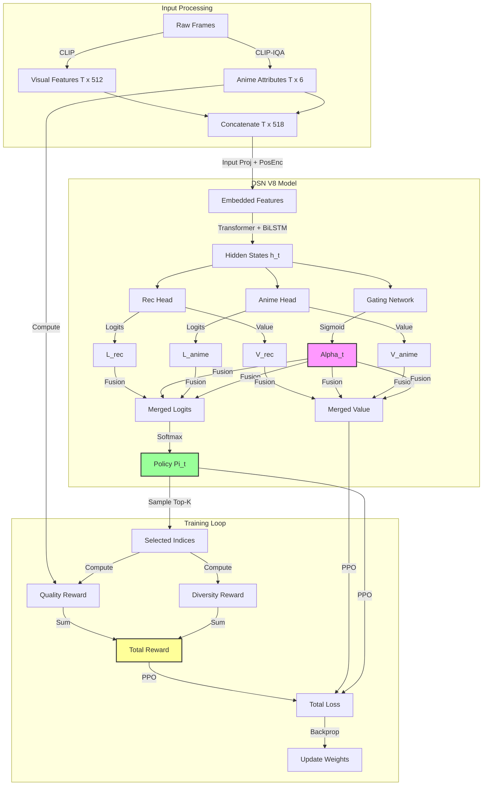

# V11 Simplified Training Pipeline Architecture

## Overview
The V11 Simplified pipeline (`train_rl_dsn_v11_simple.py`) is designed to stabilize training by simplifying the optimization process while maintaining a sophisticated underlying model architecture. It builds upon the success of `V10_stable` (which achieved MPR ~0.71) by adopting a single-objective PPO approach but extends it with diversity-aware rewards.

## 1. Input Data
- **Visual Features**: CLIP ViT-B/32 features ($T \times 512$).
- **Quality Attributes**: Anime-specific attribute scores ($T \times 6$), including 'sakuga', 'sharpness', 'colorfulness', etc.
- **Combined Input**: Concatenated tensor of shape ($1, T, 518$).
- **Budget**: Dynamic budget $B$ determined by sequence length and `budget_ratio` (default 15%).

## 2. Model Architecture: DSN Multi-Task V8
Although the training is "simplified" (no PCGrad), the model architecture remains the **Deep Summarization Network (DSN) V8** with **State-Dependent Gating**.

### Components
1.  **Shared Encoder**:
    *   **Input Projection**: Maps $518 \to 256$ dimensions + Positional Encoding.
    *   **Transformer Encoder (Self-Attention)**:
        *   Standard `TransformerEncoderLayer` with Multi-Head Self-Attention.
        *   Captures long-range dependencies across the entire video sequence.
        *   Config: `nhead=4` (default), `dim_feedforward=1024`.
    *   **BiLSTM**: Captures local temporal dependencies. Output dim: 256.

2.  **Dual-Head Policy**:
    The model maintains two specialized heads, even if optimized together:
    *   **Rec Head**: Originally designed for reconstruction/content preservation.
    *   **Anime Head**: Designed for aesthetic/quality maximization.
    *   *Each head outputs*: Raw Logits ($L$) and Value estimate ($V$).

3.  **State-Dependent Gating Mechanism**:
    *   A small specific network (`GatingNetwork`) takes the BiLSTM hidden state $h_t$.
    *   **Outputs**: A gating weight $\alpha_t \in [0, 1]$ for *each frame*.
    *   **Fusion**:
        $$ P_{final}(t) = \alpha_t \cdot P_{rec}(t) + (1 - \alpha_t) \cdot P_{anime}(t) $$
        $$ V_{final}(t) = \alpha_t \cdot V_{rec}(t) + (1 - \alpha_t) \cdot V_{anime}(t) $$
    *   This allows the model to dynamically switch strategies per frame (e.g., picking a frame for content vs. picking a frame for beauty).

## 3. Simplified Training Strategy
Unlike the standard V11 which uses PCGrad (Gradient Surgery) to optimize heads separately, this simplified pipeline treats the model as a **single end-to-end policy**.

### Optimization
*   **Algorithm**: Proximal Policy Optimization (PPO).
*   **Objective**: Maximize the expected reward of the *merged* policy $P_{final}$.
*   **Loss Function**:
    $$ L = L_{policy} + 0.5 \cdot L_{value} - \beta \cdot H_{entropy} $$
    *   $L_{policy}$: Clipped PPO loss on merged probabilities.
    *   $L_{value}$: MSE loss on merged value estimates.
    *   $H_{entropy}$: Entropy of the merged distribution to encourage exploration.

### Reward Function
The reward signal is a weighted combination of Quality and Diversity:

$$ R = R_{quality} + \lambda \cdot R_{diversity} $$

1.  **Quality Reward ($R_{quality}$)**:
    *   **Mean Percentile Rank (MPR)**: The average percentile rank of selected frames within the scene's quality distribution.
    *   **Top-10% Recall**: Bonus for selecting frames in the top 10% of quality scores.
    *   *Scale*: Normalized to roughly $[-3, 3]$.

2.  **Diversity Reward ($R_{diversity}$)**:
    *   **Gap Penalty**: Penalizes clustering of frames.
    *   $$ Score_{div} = \min(1.0, \frac{\text{min\_gap}}{\text{expected\_gap}}) $$
    *   Encourages frames to be spread out temporally.

### Selection Logic
*   **Training**: Top-$K$ sampling based on model probabilities ($P_{final}$).
    *   *Crucial Fix*: Previous versions erroneously used DPP (Ground Truth) for selection, preventing learning. This version correctly uses model outputs.
*   **Inference**: Same Top-$K$ logic.

## 4. Hyperparameters (Simplified)
*   `lr`: 1e-4 (Stable AdamW)
*   `clip_range`: 0.2
*   `entropy_coef`: 0.02
*   `diversity_weight`: 0.3

## 5. Visual Flowchart

## 6. Detailed Component Analysis & Motivation

This section explains **why** each component exists and how they work together to solve the "Sakuga" selection problem.

### 6.1. Input Processing: The "Eyes" of the Model
*   **What**: We combine standard Generic Visual features (CLIP ViT-B/32) with domain-specific Anime Attribute scores (6 dims: sakuga, sharpness, etc.).
*   **Motivation**:
    *   **CLIP alone** is good at "semantics" (what is in the image?) but often misses subtle artistic quality (is this drawing "good"?).
    *   **Anime Attributes** explicitly tell the model about the aesthetic quality.
    *   *Result*: The model sees both "This is a fight scene" (CLIP) and "This frame is poorly drawn / blurry" (Attributes).

### 6.2. Shared Encoder: Global + Local Context
The encoder architecture is a hybrid **Transformer + BiLSTM**.

#### A. Transformer Encoder (Self-Attention)
*   **What**: Standard Multi-Head Self-Attention layers.
*   **Motivation**: **Global Context**. In a video, the "best" keyframe depends on the *entire* video. For example, if a character is fighting for 10 seconds, we shouldn't pick 10 similar frames. The Transformer allows frame $t$ to "attend" to frame $t+100$ to see if they are redundant.
*   **Mechanism**: $Attention(Q, K, V) = softmax(\frac{QK^T}{\sqrt{d_k}})V$. This computes a weighted sum of *all* other frames for every frame.

#### B. BiLSTM (Bidirectional Long Short-Term Memory)
*   **What**: Processes the sequence forward and backward strictly sequentially.
*   **Motivation**: **Local Smoothness & Transition**. Video is a temporal sequence. Sudden semantic jumps are rare. The LSTM is excellent at modeling immediate temporal evolution ($h_t$ depends on $h_{t-1}$).
*   **Why Both?**: Transformers are great at "long range" but can be noisy locally. LSTMs are great at "local flow" but forget long range. Together, they give robust temporal features.

### 6.3. Dual-Head Policy with Gating: The "Brain"
This is the core innovation of DSN V8.

#### A. Two Specialized Heads (Rec & Anime)
*   **What**: Two separate neural networks reading the same encoder output.
    *   **Rec Head**: Trained (historically) to reconstruct the video $\rightarrow$ Focuses on **Representativeness** (covering the content).
    *   **Anime Head**: Trained to maximize aesthetic scores $\rightarrow$ Focuses on **Quality** (picking the "coolest" frames).
*   **Motivation**: Content Coverage and Artistic Quality are often conflicting goals.
    *   *Conflict Example*: A "summary" might need a shot of a talking face (boring but necessary for story), while "quality" wants only explosions.
    *   Separating heads allows the network to learn distinct features for distinct goals.

#### B. State-Dependent Gating Network ($\alpha_t$)
*   **What**: A small network that outputs a scalar $\alpha_t \in [0, 1]$ for *every single frame*.
*   **Motivation**: **Dynamic Trade-off**. We should not blindly average the heads.
    *   *Scenario 1*: A dialogue scene. Quality is low everywhere. $\alpha_t \to 1$ (Listen to Rec Head to cover the story).
    *   *Scenario 2*: An intense fight. Quality varies wildly. $\alpha_t \to 0$ (Listen to Anime Head to pick the best drawings).
    *   The model *learns* when to prioritize coverage vs. quality frame-by-frame.

### 6.4. Training Strategy: Simplified PPO
*   **What**: We treat the fused output ($P_{final}$) as a single policy and train it with Proximal Policy Optimization (PPO).
*   **Reward**: $R = \text{MPR} \times 6.0 + \text{Diversity} \times 0.3$.
*   **Motivation for Simplification**:
    *   Previous attempts used **PCGrad** (Projecting gradients) to optimize heads separately. This was mathematically fancy but numerically unstable (gradients fighting each other leading to NaNs/collapse).
    *   **Simplified Approach**: By summing the rewards and checking the *final* output, we let backpropagation naturally figure out how to tune `Rec`, `Anime`, and `Alpha` to maximize the global score. It's more stable and robust.
