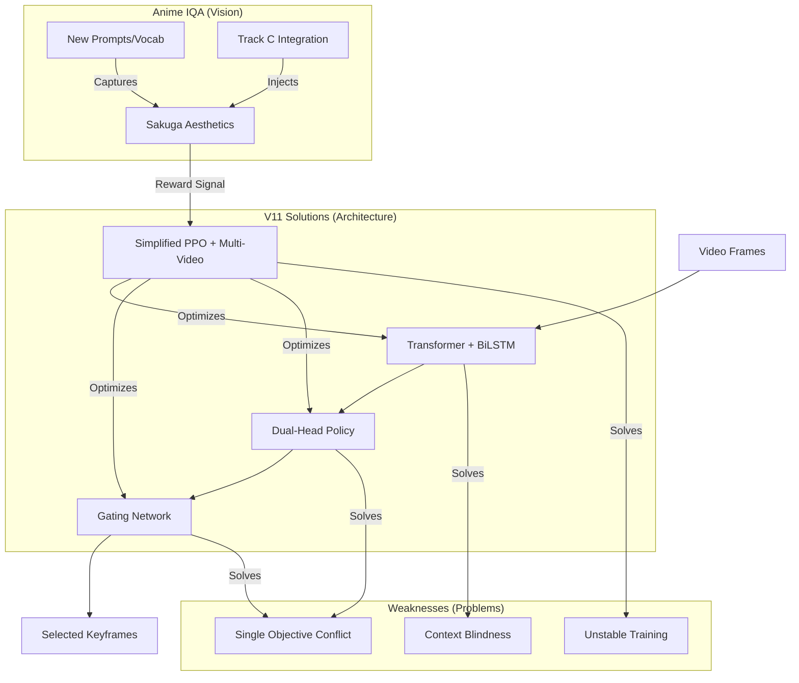

# Deep Summarization Network (DSN) Analysis & V11 Evolution

This document provides a logical, step-by-step analysis of the DSN architecture, highlighting the weaknesses of the original approach and detailing how the V11 implementation addresses them through specific architectural and procedural innovations.

## 1. Weaknesses of Original DSN (AAAI 2018)
*Based on "Deep Reinforcement Learning for Unsupervised Video Summarization With Diversity-Representativeness Reward" (Zhou et al., AAAI 2018).*

### 1.1. The "Visual-Semantic" Gap (The Sakuga Problem)
*   **Original Paper Goal**: The AAAI 2018 paper optimizes for **Representativeness** (minimizing reconstruction error) and **Diversity** (feature dissimilarity).
*   **Weakness for Anime**: "Representativeness" assumes the "best" frames are those that mathematically reconstruct the video content (often static, clearly defined lines).
*   **The Gap**: High-quality Anime scenes ("Sakuga") are often **outliers** in terms of pixel statistics (motion blur, dynamic distortion, abstract backgrounds).
    *   *Result*: The original DSN actively *penalizes* Sakuga because these frames are hard to reconstruct and mathematically "noisy."
    *   *Conclusion*: A generic unsupervised reward is fundamentally misaligned with the specific goal of "Aesthetic/Sakuga" selection.

### 1.2. Optimization Conflict (The "Collapsed Mode")
*   **Original Architecture**: used a single Policy Network to output selection probabilities $\pi_\theta(a|s)$.
*   **Weakness**: The paper combines conflicting rewards ($R_{rep}$ and $R_{div}$) into a single scalar $R = R_{rep} + \lambda R_{div}$.
*   **Problem**: In practice (especially on Anime data), these objectives fight each other.
    *   *Example*: A fight scene is high-diversity (lots of change) but low-representativeness (hard to reconstruct).
    *   *Failure Mode*: A single-head policy tends to converge to a safe "average" (mediocre frames) rather than learning to switch strategies, leading to "bland" summaries.

### 1.3. Lack of Temporal State-Awareness
*   **Original Approach**: The decoder uses a standard LSTM where the hidden state evolves, but the *selection strategy* is constant across time.
*   **Weakness**: The model treats "Action" segments and "Dialogue" segments with the same policy logic.
*   **Problem**: It cannot say "I am in a fight scene, ignore reconstruction and focus on coolness." It applies the same weight $\lambda$ globally.

### 1.4. Instability in Adversarial/RL Settings
*   **Paper Context**: Zhou et al. proposed DSN specifically to fix the instability of GAN-based summarizers.
*   **Remaining Issue**: However, pure RL on high-dimensional video features (like GoogLeNet used in the paper) is still unstable without carefully tuned baselines or gradient clipping.
*   **V11 Need**: We needed a more robust training stabilizer than the standard REINFORCE algorithm used in the original paper.

---

## 2. Related Architectures & Motivations (Academic Context)
*How DSN V11 positions itself among modern unsupervised summarization approaches.*

### 2.1. GAN-Based Approaches (Reconstruction Focus)
*   **SUM-GAN (CVPR 2017)**: Uses an adversarial LSTM to select frames that can "reconstruct" the original video roughly.
    *   *Concept*: Feature vectors of the summary + Decoder $\approx$ Feature vectors of original video.
    *   *Why V11 Avoids This*: GAN training is notoriously unstable ("Mode Collapse"). In Anime, a GAN might learn to just pick generic "safe" frames (dialogue) to minimize discriminator loss, failing to take risks on "Sakuga" (which looks "fake" or "noisy" to a discriminator trained on normal frames).
*   **Cycle-SUM (AAAI 2019)**: Adds a "Cycle-Consistency" loss. Summary $\to$ Video $\to$ Summary.
    *   *Motivation*: Ensures maximum "Information Preservation".
    *   *Limitation for Anime*: "Information" here means semantic content (objects, scenes). It does not preserve "Style" or "Artistic Appeal". Maximizing information preservation often leads to redundancy avoidance, but Sakuga fans *want* to see the full fluid sequence, not just the start and end keyframes.

### 2.2. RL-Based Approaches (Sequential Decision)
*   **DR-DSN (AAAI 2018)**: The foundation of our V11. Defined the problem as a "Sequential Decision Process" using RL.
    *   *Key Insight*: Summarization is not just classification; it's a sequence where picking frame $t$ affects the value of frame $t+1$ (redundancy).
    *   *Evolution to V11*: V11 keeps the RL core (Sequential Decision) but replaces the generic "Representation Reward" with a domain-specific "Aesthetic Reward".
*   **Weakly Supervised RL with Semantic Reward (WACV 2021)**:
    *   *Insight*: "Diversity and Representativeness are low-level clustering metrics."
    *   *Solution*: Proposed adding a "Semantic Reward" (semantic similarity to video category).
    *   *V11 Adoption*: This heavily motivates our **Anime-CLIP-IQA** integration. We moved from generic objectives to semantic objectives ("Is this Sakuga?", "Is this Cinematic?").

### 2.3. Self-Supervised / Contrastive (Modern Era)
*   **TRIM (arXiv 2025) / TCL-VS**: Recent works using Contrastive Learning (SimCLR style) to learn "what is important" without labels.
*   **Connection**: These provide strong signals for "general importance," but they still lack the "Production Quality" awareness needed for Anime. V11 can be seen as applying **RL (specific policy)** on top of **Self-Supervised Features (CLIP)**.

---

## 3. DSN V11: Motivations & Implementation Logic

The V11 architecture is engineered specifically to address the above weaknesses.

### 3.1. Dual-Head Policy (Solving the Single-Objective Trap)
* **Implementation**: The model splits after the backbone into two distinct heads:
    1.  **Rec Head (Reconstruction)**: Trained implicitly to understand coverage/story.
    2.  **Anime Head (Aesthetic)**: Trained implicitly to maximize visual quality.
* **Motivation**: By decoupling the objectives, each head can become a "specialist". The Anime Head doesn't need to worry about the story, and the Rec Head doesn't need to worry about quality. This eliminates the internal conflict during feature extraction.

### 3.2. State-Dependent Gating (Solving Rigid Selection)
* **Implementation**: A simple fully connected network `GatingNetwork` that determines the mixing weight.
    *   **Input**: The contextual hidden state $h_t$ (dim: 256) from the Hybrid Encoder at frame $t$.
    *   **Output**: A scalar gating weight $\alpha_t \in [0, 1]$ (after Sigmoid activation).
    *   **Formula** (Notation $\pi$ denotes Policy/Selection Probability):
    $$ \pi_{fused}(a_t|s_t) = \alpha_t \cdot \pi_{rec}(a_t|s_t) + (1 - \alpha_t) \cdot \pi_{anime}(a_t|s_t) $$
    *(Note: In earlier sections we used $P$, but $\pi$ is the standard RL notation for "Policy". They mean the same "Probability of selecting frame $t$".)*
* **Motivation**: This allows the model to dynamically switch strategies.
    *   *Detects Action* $\rightarrow$ $\alpha_t \approx 0$ (Trust Anime Head).
    *   *Detects Plot Point* $\rightarrow$ $\alpha_t \approx 1$ (Trust Rec Head).
* **Benefit**: The model becomes "context-aware," optimizing for the *current* scene's needs rather than a global average.

### 3.3. Hybrid Encoder Backbone (Solving Static Processing)
* **Implementation**:
    1.  **Transformer Encoder**: Captures **Global Context** (Long-range dependencies). It answers: "Have I seen a similar shot 5 minutes ago?" (Redundancy check).
    2.  **BiLSTM**: Captures **Local Context** (Temporal flow). It answers: "Is this a smooth continuation of the previous frame?" (Transition check).
* **Motivation**: Combining these gives the model a complete understanding of the video: accurate local motion sensing (vital for Sakuga) plus smart global content management (vital for Summarization).

### 3.4. Multi-Video Gradient Accumulation (Solving Stability & Speed)
* **Implementation**: Instead of padding videos to a fixed size (slow, artifacts), V11 processes $N$ videos sequentially and accumulates gradients before a single optimizer step.
* **Motivation**:
    1.  **Statistical Stability**: Gradients averaged over multiple videos reduce the noise from any single "weird" video.
    2.  **Speed**: Allows processing videos of native length without wasteful padding computations.
    3.  **Correctness**: Prevents padding zeros from influencing the Batch Normalization or Attention statistics.

### 3.5. Simplified PPO (Solving Complexity): The Fusion Strategy

#### A. Implementation: "Pre-Loss Fusion"
*   **Concept**: Instead of calculating separate losses for each head and fighting with gradients (like PCGrad), V11 simplifies optimization by **merging the policy probabilities** *before* the PPO loss calculation.
*   **The Fusion Formula**:
    $$ \pi_{fused}(a_t|s_t) = \alpha_t \cdot \pi_{rec}(a_t|s_t) + (1-\alpha_t) \cdot \pi_{anime}(a_t|s_t) $$
    *   $\pi_{rec}$: Probability from Recommendation Head.
    *   $\pi_{anime}$: Probability from Anime Head.
    *   $\alpha_t$: Dynamic gating weight for frame $t$.

#### B. Architecture Flow
1.  **Shared Backbone**: Processes video features $x_t$ into hidden state $h_t$.
2.  **Dual Prediction**: Both heads output their independent opinions ($\pi_{rec}, \pi_{anime}$) for the frame.
3.  **Gating Decision**: The Gating Network decides $\alpha_t$, effectively choosing which expert to trust for this specific moment.
4.  **Scalar Reward**: The environment provides a *single* final reward $R_{total}$ (combining aesthetic + redundancy).
5.  **PPO Optimization**: This single $\pi_{fused}$ and single $R_{total}$ are fed into standard PPO.

#### C. Motivation: "Let Backprop Figure It Out"
*   **The PCGrad Problem**: Gradient Surgery (PCGrad) is mathematically elegant but **computationally brittle**. It requires $2\times$ backward passes and manual projection of gradient vectors, which often leads to training instability if the tasks are too divergent.
*   **The PPO Solution**: By treating the *fused* result as the only policy, we let the standard Backpropagation algorithm automatically compute gradients for $\alpha$, $\pi_{rec}$, and $\pi_{anime}$ simultaneously.
    *   *Mechanism*: If the model picks a bad frame, $R_{total}$ is low. Backprop will automatically punish the "active" head (high $\alpha$) or adjust the gating weight $\alpha$ itself.
    *   *Result*: significantly more stable convergence in practice compared to manual gradient interference.

---

## 4. Anime-CLIP-IQA: Enhancing the "Vision"

Standard metrics (like FID or simple CLIP score) fail to capture the specific "vibe" of high-quality anime (Sakuga).

### 3.1. Core Idea & Modification
* **Original CLIP-IQA**: Designed for real-world photos (lighting, contrast, composition).
* **Anime Adaptation**:
    *   **New Prompts**: Replaced "Good lighting" with specific anime terms: "Sakuga", "Sharp embedding", "Cinematic composition", "Vibrant colors".
    *   **Vocabulary**: Trained on a specific anime corpus to understand that "blur" in anime might be a "speed line" (good) rather than an error (bad).

### 3.2. Integration Tracks (Strategies)
We implemented three logical tracks to inject this knowledge, testing different hypotheses:

#### A. Track A: "Feature-only" (The Eyes)
*   **Method**: Concatenate the 6 attribute scores to the input vector ($512 + 6$).
*   **Motivation**: Give the model "eyes" to see the quality. If the model *knows* a frame is blurry, it *can* choose to avoid it.
*   **Logic**: "I see this is ugly, so I might skip it."

#### B. Track B: "Reward-only" (The Incentive)
*   **Method**: Keep inputs standard. Add specific rewards ($+R_{sakuga}$, $+R_{sharpness}$) for picking high-scoring frames.
*   **Motivation**: Explicitly force the behavior.
*   **Logic**: "I don't see 'sharpness', but I get a cookie every time I pick a specific type of frame, so I will learn to pick those."

#### C. Track C: "Combined" (Full Integration)
*   **Method**: Both Inputs and Rewards.
*   **Motivation**: The strongest signal. The inputs make the task easier (no need to guess quality), and the rewards ensure the features are actually used.

---

## 5. Logical Flow Summary

## 6. Additional Hidden Motivations

*   **Diversity Reward ($R_{div}$)**: 
    *   **Why?** Without this, the model tends to "collapse" into picking adjacent frames (e.g., frames 100, 101, 102) because they are all "high quality".
    *   **Fix**: A penalty logic that forces frames to be temporally distant, ensuring the summary covers the *whole* event.
*   **Dynamic Budgeting**:
    *   **Why?** A fixed "15 keyframes" rule is bad for a 10-second clip versus a 5-minute clip.
    *   **Fix**: Budget is dynamic ($15\%$) of video length, allowing the summary density to scale with content size.
