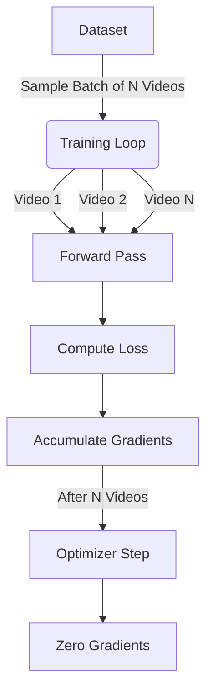

# Multi-Video RL Training for DSN

## Overview

The Multi-Video RL Training pipeline enables training the Deep Summarization Network (DSN) on batches of videos simultaneously. This improves generalization, stabilizes training gradients, and allows for more robust policy learning compared to the single-video approach.

## Key Features

1. **Gradient Accumulation**: 
   - Instead of padding variable-length videos into a single tensor (which can cause artifacts with multi-scale models), we process videos sequentially in a batch and accumulate their gradients.
   - The optimizer step is taken only after processing `batch_size` videos.
   - This ensures 100% mathematical correctness with the `DSNAdvanced` architecture.

2. **Multi-Video Replay Buffer**:
   - Manages episodes from multiple videos.
   - Supports `random_uniform` sampling to reduce correlation between consecutive updates.

3. **Unified Reward System**:
   - Fully integrated with the V2 Anime Reward System (Look, Sakuga, Story).

## Usage

### Training Script

Use the provided bash script to start training:

```bash
bash scripts/rl/train_dsn_multi.sh
```

### Key Arguments

- `--multi_video 1`: Enable multi-video mode.
- `--batch_size N`: Number of videos to accumulate gradients over before an update step.
- `--sampling_strategy`:
  - `random_uniform`: Randomly sample videos for each batch (Recommended).
  - `round_robin`: Iterate through videos in order.
- `--video_list "vid1,vid2"`: Optional comma-separated list of video IDs to train on specific subsets.

### TensorBoard Monitoring

```bash
tensorboard --logdir runs/dsn_rl_multi_video/logs --port 6006
```

**New Metrics:**
- `gradients/norm_before_clip_mean`: Monitor gradient stability across batches.
- `train/mean_reward`: Global average reward across all videos in the batch.

## Architecture



## Benefits

- **Stability**: Averaging gradients over multiple videos reduces variance from outlier videos.
- **Generalization**: The model learns features that are robust across different video styles and contents.
- **Efficiency**: Reduces the frequency of expensive optimizer steps.
